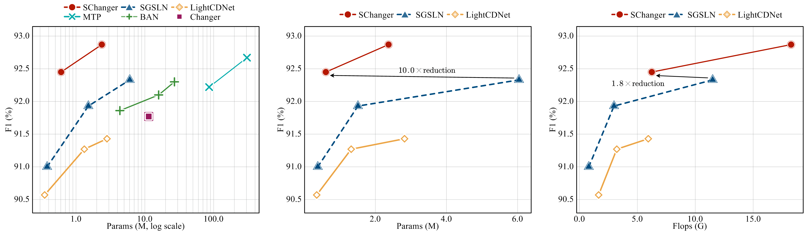

## SChanger: Change Detection from a Semantic Change and Spatial Consistency Perspective (IEEE JSTARS 2025)

<h5 align="left">Ziyu Zhou, Keyan Hu, Yutian Fang and Xiaoping Rui</h5>

[[`Paper`](https://arxiv.org/abs/2503.20734)]


<p align="center">
    
</p>

### News

- 2025/03, Accepted by IEEE JSTARS.

### Catalog

Paper F1 scores (%) from Tables III-VIII of the
[published article](https://doi.org/10.1109/JSTARS.2025.3555849).
The current WHU-CD small result is shown in parentheses.

| Model | LEVIR-CD | LEVIR-CD+ | S2Looking | CDD | SYSU-CD | WHU-CD |
| --- | ---: | ---: | ---: | ---: | ---: | ---: |
| SChanger-small | 92.45 | 86.20 | 68.20 | 95.75 | 84.58 | 93.15 (93.51) |
| SChanger-base | 92.87 | 86.43 | 68.95 | 97.62 | 84.17 | 93.20 |


---------------------

### Training

```sh
python -m pip install -r requirements-train.txt
python pretrain.py --model base --data-root /datasets/iaild1000
python train.py --dataset levir-cd --model base --data-root /datasets/LEVIR-CD
```

Training parameters are in `training_configs.json`. Missing base or small initialization
weights are downloaded automatically; use `--init` to select another checkpoint or
`--from-scratch` to disable initialization.


### Evaluation

Evaluate the official checkpoints with 256x256 non-overlapping tiles:

```sh
python -m pip install -r requirements-eval.txt
python evaluation/evaluate.py --dataset levir-cd
python evaluation/evaluate.py --dataset levir-cd+
python evaluation/evaluate.py --dataset s2looking
python evaluation/evaluate.py --dataset cdd
python evaluation/evaluate.py --dataset sysu-cd
python evaluation/evaluate.py --dataset whu-cd
```

See [evaluation/README.md](evaluation/README.md) for dataset preparation, automatic
weight downloads, training normalization, CPU/CUDA options and the evaluation protocol.

### Citation

If you use SChanger in your research, please cite:
```text
@article{zhou2025schanger,
  title={SChanger: Change Detection from a Semantic Change and Spatial Consistency Perspective},
  author={Zhou, Ziyu and Hu, Keyan and Fang, Yutian and Rui, Xiaoping},
  journal={IEEE Journal of Selected Topics in Applied Earth Observations and Remote Sensing},
  volume={18},
  pages={10186--10203},
  year={2025},
  doi={10.1109/JSTARS.2025.3555849}
}
```

### License
This code is released under the [Apache License 2.0](https://github.com/Z-Zheng/ChangeStar/blob/master/LICENSE).

Copyright (c) Ziyu Zhou. All rights reserved.
